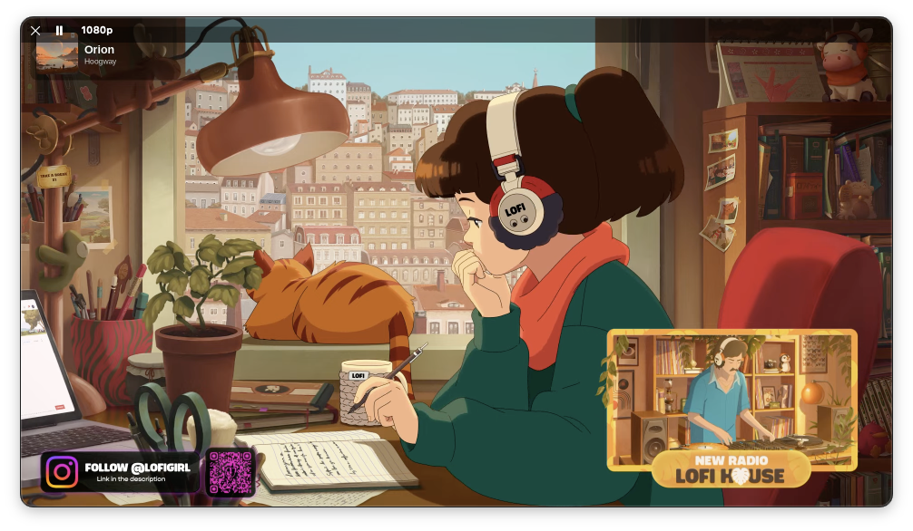

# LofiGirl: Minimal Lofi Girl YouTube Player for macOS

A tiny native macOS app that plays the Lofi Girl live stream (lofi hip hop radio, beats to relax/study to) in a frameless, picture-in-picture style window. No browser, no tabs, no live chat, no YouTube interface. Just the video, a close button, and play/pause.

Open the app and the stream starts playing in 1080p.



## Features

- Starts streaming the Lofi Girl live stream on launch, no clicks required
- Frameless, rounded-corner window with no title bar or window decorations
- Behaves like a normal application window: other windows can cover it and it comes forward when you click it
- Click and drag anywhere in the window to move it
- Resize from any edge or corner; the window keeps a 16:9 aspect ratio
- Hover the window to reveal a close button and a play/pause button
- Forces 1080p playback by default; a button in the hover bar switches between 1080p and Auto (YouTube adaptive quality), and the choice is remembered
- Automatically skips or mutes pre-roll ads
- Stays on the Space (desktop) where you leave it
- Custom macOS 26 icon built with Icon Composer
- Single Swift file, no dependencies, no Xcode project

## Requirements

- macOS 12 or later to run
- Xcode Command Line Tools to build (`xcode-select --install`)
- Full Xcode 26 or later, optional, only to compile the custom app icon. Without it the app builds with the default icon.

## Download

Download `LofiGirl.dmg` from the [latest release](https://github.com/zach-the/lofi-girl-launcher/releases/latest), open it, and drag LofiGirl into Applications.

The app is ad-hoc signed, not notarized. If macOS blocks it on first launch, right-click the app and choose Open, or run:

```sh
xattr -dr com.apple.quarantine /Applications/LofiGirl.app
```

## Build and install

```sh
git clone https://github.com/zach-the/lofi-girl-launcher.git
cd lofi-girl-launcher
./build.sh
```

This produces `~/Applications/LofiGirl.app`. To build elsewhere, pass a path:

```sh
./build.sh /path/to/LofiGirl.app
```

The build compiles `src/main.swift` with `swiftc`, assembles the app bundle, compiles the icon with `actool` if Xcode is present, and applies an ad-hoc code signature. On first launch macOS may require you to right-click the app and choose Open.

To build a distributable app and DMG in `dist/`, run `./package.sh`.

To add it to the Dock, launch the app, right-click its Dock icon, and choose Options, then Keep in Dock.

## Usage

| Action | How |
| --- | --- |
| Move the window | Click and drag anywhere in the window |
| Resize | Drag within 16 px of any edge or corner |
| Play or pause | Hover the window, click the pause/play button at the top left |
| Switch quality | Hover the window, click the quality label (1080p or Auto) next to the play button |
| Quit | Hover the window, click the X at the top left |

## How it works

The app is a borderless `NSWindow` containing a `WKWebView`.

YouTube refuses to embed this stream in an iframe (player error 152/153), so the app loads the regular watch page instead. An injected script then:

1. Moves the page's `<video>` element into a fullscreen overlay and hides everything else on the page, so no YouTube interface is visible.
2. Calls `play()` on the video once it is ready.
3. Sets the playback quality to 1080p through the player API, and reapplies it periodically because YouTube's adaptive bitrate can lower it. In Auto mode it stops forcing and hands control back to YouTube.
4. Detects ads through the player's `ad-showing` state, mutes them, clicks Skip when available, and seeks to the end of the ad.

The native layer adds the rounded corners (a layer mask on the content view), the hover controls, dragging (`performDrag`), and a custom edge-resize handler, because the video overlay would otherwise block the window's built-in resizing.

## Changing the stream

The video ID is set in `src/main.swift` in the `web.load(...)` call:

```swift
web.load(URLRequest(url: URL(string: "https://www.youtube.com/watch?v=rFZHOHl-L8A")!))
```

Replace `rFZHOHl-L8A` with any YouTube video or live stream ID and rebuild. Note that `youtube.com/@LofiGirl/live` does not work for this purpose: it redirects to whichever Lofi Girl stream is currently marked live, which is not always the studying-girl stream. If Lofi Girl ever retires this video ID, the window will show a "video unavailable" page until you update the ID.

## Icon

The icon source is `AppIcon.icon`, an Icon Composer document with two layers: a diagonal orange-to-purple background (`Assets/bg.png`) and the logo (`Assets/logo.png`). `tools/make-icon-background.swift` regenerates the background image. `build.sh` compiles the document into `Assets.car` and `AppIcon.icns` with `actool`.

macOS 26 draws a plate behind any icon that lacks a full background, which is why the icon has a background layer instead of a transparent one.

## Project layout

```
src/main.swift                       Application source
Info.plist                           App bundle metadata
AppIcon.icon/                        Icon Composer icon source
tools/make-icon-background.swift     Generates the icon background gradient
build.sh                             Builds and signs the app bundle
package.sh                           Builds dist/LofiGirl.app and dist/LofiGirl.dmg
LICENSE                              MIT license
```

## Limitations

- Requires network access; it is a wrapper around the YouTube website and depends on YouTube's page structure. A YouTube redesign can break the video extraction or quality forcing.
- Ad handling relies on YouTube's current player class names and may stop working if they change.
- The app is ad-hoc signed, not notarized.
- Playback quality above what your connection supports will buffer.

## License

MIT. See [LICENSE](LICENSE).

## Disclaimer

This project is not affiliated with, endorsed by, or sponsored by Lofi Girl or YouTube. The stream, name, and artwork belong to their respective owners. This app only displays the publicly available stream through YouTube's own website.

## Keywords

macOS Lofi Girl player, lofi hip hop radio desktop app, YouTube live stream player without browser, frameless video window Mac, picture-in-picture YouTube macOS, frameless WKWebView Swift app, minimal YouTube wrapper, lofi beats to relax study to.
